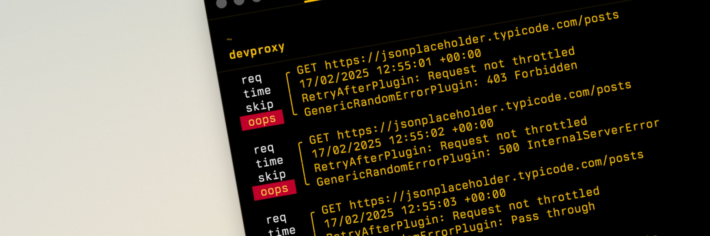

<h1 align="center"> 
  
  
Dev Proxy
  
</h1>

<h4 align="center">
  Test the untestable
</h4>

  
   
   
   
  <a href="https://aka.ms/devproxy">
    Documentation
  </a>

# What is Dev Proxy?

Dev Proxy is an API simulator that helps you effortlessly test your app beyond the happy path. Dev Proxy is a command-line tool that works on any platform. Because it intercepts network requests, it works with any type of app and tech stack.

Dev Proxy is **open source** and **free to use**.

You test your app to make sure it works as intended. But what if the APIs you use fail? Will your app lose your customer's data? How do you test for this? Simulating API failures is hard. You end up writing code that you won't be shipping or worse: not testing at all. That's why we built Dev Proxy, to simulate API errors so that you can easily test your app without changing your code.

With Dev Proxy you:

- **See how your app responds to API errors**, without changing your app’s code, so that you can **build more robust apps and don't lose customers' data**.
- **Verify how your app handles API rate limits**, so that you can avoid getting throttled and **improve the user experience for your customers**.
- **See how your app handles slow APIs**, so that you can implement the necessary affordances, and **make your app more user-friendly**.
- **Quickly stand-up mock APIs** without writing a line of code, so that you can **focus on building your app instead of writing code you won't be shipping**.
- Improve your app with contextual guidance on how you use APIs, to **make your app even better**.

## Get started

To get started with Dev Proxy, follow our [tutorial](https://aka.ms/devproxy/start) to install and run Dev Proxy for the first time.

## .NET Foundation

This project is supported by the [.NET Foundation](https://dotnetfoundation.org).
